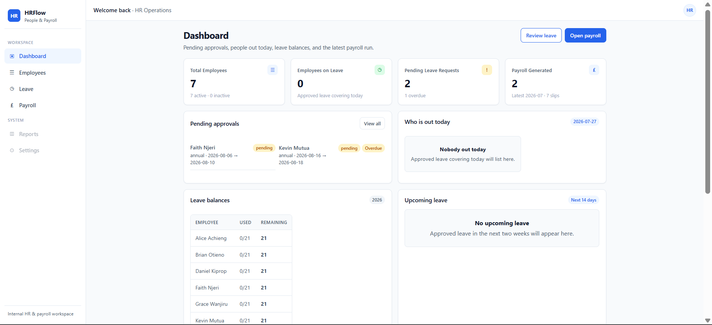
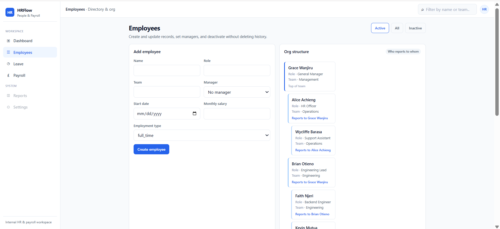
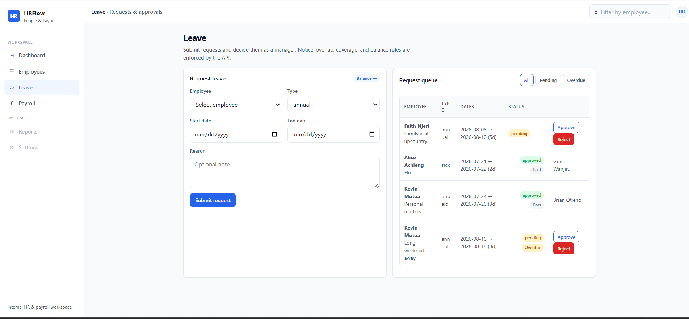
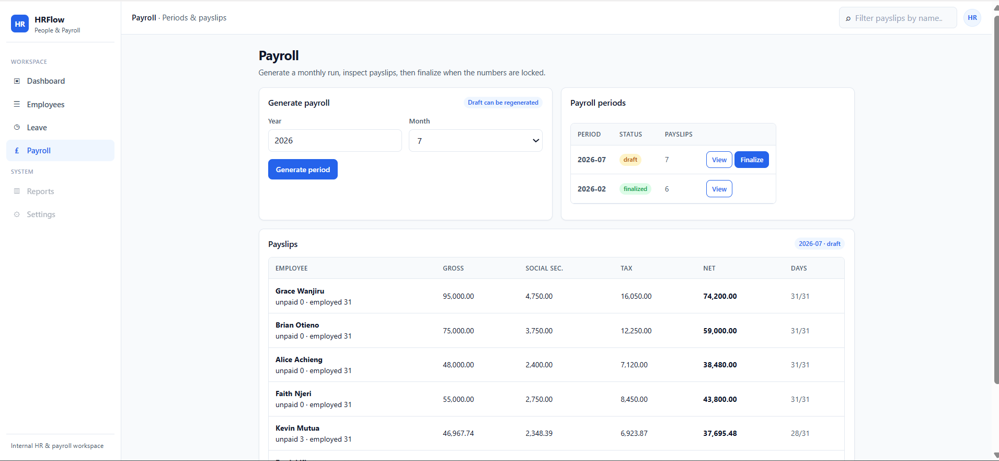

# HRFlow Platform

An internal HR and Payroll management platform for employee records, leave approvals, and monthly payslips.

Teams often handle this over spreadsheets and chat. Requests get lost, coverage is unclear, and payroll is calculated by hand. HRFlow keeps those workflows in one place with enforceable rules — notice periods, team coverage, and payslip math that can be verified.

## Project Status

Built as a Software Engineering practical assessment. Core employee, leave, and payroll workflows are implemented and covered by tests.

**Implemented**
- Flask application factory
- Environment-based configuration
- Database models (employees, leave, payroll)
- Initial Alembic migration
- Seed command with sample data
- API health endpoint
- Employee records API (CRUD, deactivate, org tree)
- Leave management API (request, approve/reject, balances)
- Leave business rules (notice, overlaps, coverage, overdue)
- Payroll calculation engine (proration, tax, social security)
- Payslip generation and payroll periods
- Backend tests for core leave and payroll logic
- Frontend shell (pages, shared styles, API client)
- Dashboard API and live dashboard UI
- Employee management UI (create, edit, deactivate, org view)
- Leave workflow UI (request, approve/reject, overdue filters)
- Payroll UI (generate, payslips, finalize)
- Frontend loading, empty, and error-state polish
- Mobile-responsive layout
- Final UI polish and README screenshots
- Docker Compose setup (app + PostgreSQL)
- Sample database SQL dump (`database/hrflow_sample.sql`)

## Tech Stack

**Backend**
- Flask
- SQLAlchemy
- Flask-Migrate

**Database**
- PostgreSQL

**Frontend**
- HTML
- CSS
- Vanilla JavaScript

**Testing**
- Pytest

**DevOps**
- Docker (optional local deployment)

## Focus

HRFlow implements all three modules because they depend on each other operationally. Development prioritizes business-critical workflows first:

1. **Leave** — approvals, balances, and safeguards (short notice, overlaps, under-covered teams, stalled requests)
2. **Payroll** — monthly payslips with proration, unpaid leave deductions, and a simple tax + social security scheme
3. **Employees** — records and reporting lines solid enough to support leave and payroll, including soft deactivation so history stays intact

Employee management stays lean on purpose. Leave rules and payroll correctness are the parts worth getting right.

## Features

### Employees
- Create and update records (name, role, team, manager, start date, salary, employment type)
- Org view showing who reports to whom
- Deactivate instead of delete

### Leave
- Request time off
- Manager approve or reject
- Annual balances tracked per year
- Unpaid leave reduces that month’s gross pay

Rules:

| Situation | Rule |
|---|---|
| Annual leave booked too late | At least 3 calendar days notice (sick leave exempt) |
| Overlapping dates for the same person | Blocked against pending or approved leave |
| Too many people out on the same team | Teams of 2+ capped at about 50% of active members off on the same day |
| Requests left unanswered | Pending longer than 5 business days marked overdue on the dashboard |
| Unpaid time off | Days fall out of eligible pay days for the month |

### Payroll
- Generate a payslip per active employee for a given month
- Gross pay prorated for mid-month starters and unpaid leave
- Flat social security plus bracketed income tax
- Net pay stored with the calculation breakdown

## Architecture

```
Browser (HTML, CSS, Vanilla JS)
              |
              | REST / JSON
              v
Flask API
(routes/controllers)
              |
              v
Business Services
(leave rules + payroll calculations)
              |
              v
PostgreSQL
(SQLAlchemy + Flask-Migrate)
```

Route handlers stay thin. Leave rules and payroll calculations live in a service layer so the important logic is easy to test.

Frontend is plain HTML/CSS/JS — no React or Vue.

Docker is optional. Local run with a virtualenv and PostgreSQL is the default path; `docker compose up --build` is the one-command alternative.

## Access model

Authentication and role-based authorization were intentionally left out of the core implementation because they were outside the main focus of this assessment. The current interface demonstrates the complete HR workflow in a single application — employees requesting leave, managers deciding requests, and payroll generation side by side.

In a production deployment, employees, managers, and HR administrators would have role-based permissions exposing only the features relevant to their responsibilities.

## Leave rules

- Types: annual, sick, unpaid
- Annual leave uses balance; unpaid does not, but it affects payroll
- Sick leave skips the notice check
- Approvals go through the employee’s manager
- Rejected or cancelled requests do not change coverage or balances

## Payroll formula

Simplified scheme for this project — not tied to a real country’s tax code.

Assumptions:
- Pay period is a calendar month
- Base figure is the employee’s monthly salary
- Proration uses calendar days in the month

**Gross**

```
eligible_days = days employed in the month
              - unpaid leave days in that month

gross = monthly_salary * (eligible_days / days_in_month)
```

Mid-month joiners count from `start_date`. Inactive employees are skipped on new runs.

**Social security**

```
social_security = gross * 0.05
```

**Taxable income**

```
taxable = gross - social_security
```

**Income tax**

| Taxable amount | Rate |
|---|---|
| 0 – 5,000 | 0% |
| 5,001 – 15,000 | 10% on the amount above 5,000 |
| 15,001+ | 10% on 5,001–15,000, then 20% on the rest |

**Net**

```
net = gross - social_security - tax
```

Cases covered in tests:
- Mid-month start date
- Salary on a bracket boundary
- Heavy unpaid leave bringing gross near zero
- Taxable income that stays in the 0% band

## Setup

### Manual
Requirements: Python 3.11+ and PostgreSQL 14+.

```bash
python -m venv .venv
```

Activate the environment:

```bash
# Windows PowerShell
.\.venv\Scripts\Activate.ps1

# macOS / Linux
source .venv/bin/activate
```

Install dependencies and create the local environment file:

```bash
pip install -r requirements.txt
cp .env.example .env
```

On Windows PowerShell, use `Copy-Item .env.example .env` instead of `cp`.

Update `DATABASE_URL` in `.env` with local PostgreSQL credentials. If the password contains special characters such as `@`, URL-encode them (for example `@` becomes `%40`).

Create the database once:

```sql
CREATE DATABASE hrflow;
```

Apply migrations and load sample data:

```bash
flask db upgrade
flask seed
```

Start the development server:

```bash
python run.py
```

The app UI is available at `http://127.0.0.1:5000/`.

The API health check is available at `http://127.0.0.1:5000/api/health`.

### Docker

Requires Docker Desktop (or another Docker Engine) with Compose.

From the project root:

```bash
docker compose up --build
```

On first start the `web` container waits for Postgres, runs `flask db upgrade`, runs `flask seed` (skipped if data already exists), then serves the app.

- UI: `http://127.0.0.1:5000/`
- Health: `http://127.0.0.1:5000/api/health`

Stop with `Ctrl+C`, or in another terminal:

```bash
docker compose down
```

Postgres data is kept in the `hrflow_pgdata` volume. To wipe the database and reseed:

```bash
docker compose down -v
docker compose up --build
```

Compose uses these defaults for the container network (not your local `.env`):

- User / password / database: `hrflow` / `hrflow` / `hrflow`
- App `DATABASE_URL`: `postgresql+psycopg://hrflow:hrflow@db:5432/hrflow`

Manual venv + local PostgreSQL remains the default development path; Docker is the optional one-command alternative.

## API endpoints

Base path: `/api`

**Employees**
- `GET /api/employees`
- `POST /api/employees`
- `GET /api/employees/<id>`
- `PATCH /api/employees/<id>`
- `POST /api/employees/<id>/deactivate`
- `GET /api/employees/org`

**Leave**
- `GET /api/leave` (filters: `status`, `employee_id`, `overdue`)
- `POST /api/leave`
- `POST /api/leave/<id>/approve`
- `POST /api/leave/<id>/reject`
- `GET /api/leave/balances/<employee_id>`
- `GET /api/leave/coverage?date=YYYY-MM-DD&team=...`

**Payroll**
- `POST /api/payroll/preview` — calculate without saving
- `POST /api/payroll/generate` — create/regenerate draft period + payslips
- `GET /api/payroll/periods`
- `GET /api/payroll/periods/<id>/payslips`
- `POST /api/payroll/periods/<id>/finalize`
- `GET /api/payroll/payslips/<id>`

**Dashboard**
- `GET /api/dashboard` — pending approvals, who’s out, balances, payroll snapshot

## Tests

Install development dependencies, then run the suite:

```bash
pip install -r requirements-dev.txt
pytest
```

The current suite contains 25 tests covering:
- Notice period
- Overlaps
- Team coverage
- Overdue requests
- Manager approval and annual balance deductions
- Payroll proration
- Tax and social security, including edge cases
- Payroll generation, draft regeneration, and finalization

## Sample data

`database/hrflow_sample.sql` is a PostgreSQL dump (schema + sample data) included with the project. It contains:

- 7 employees with manager relationships
- Leave balances for the current year
- Leave requests in mixed statuses (pending, overdue pending, approved sick, approved unpaid)
- Payroll periods: `2026-02` (finalized) and `2026-07` (draft) with payslips

Restore into an empty database:

```bash
psql -U postgres -d hrflow -f database/hrflow_sample.sql
```

Windows (PowerShell), if `psql` is available:

```powershell
psql -U postgres -d hrflow -f database/hrflow_sample.sql
```

Local development can also use `flask seed` after migrations for a comparable starter dataset.

## Screenshots

### Dashboard



### Employees



### Leave



### Payroll



## Later improvements

Given more time, the next upgrades would be:

- Authentication and role-based permissions (see Access model above)
- Notifications for overdue leave requests
- Proper accrual and carry-over for annual leave
- PDF payslips
- Audit trail for approvals and payroll runs
- Team leave calendar
- CI/CD pipeline integration
- Cloud deployment configuration
